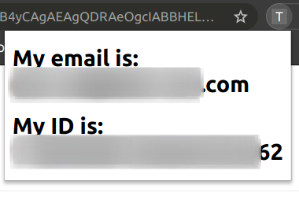

## Test Google identity in Chrome extension
This is a sample Chrome extension to get logged in user's Google identity.

## Permissions
Required permissions in `manifest.json`:
- identity
- identity.email

## How to test it?
1. Clone this repo.
2. Go to `chrome://extensions`.
3. At the top right, turn on `Developer mode`.
4. Click `Load unpacked`.
5. Find and select the folder of this repo.
6. Click `Extensions` button.
7. On the dropdown list, click `Test identity` extension.

## Screenshot

